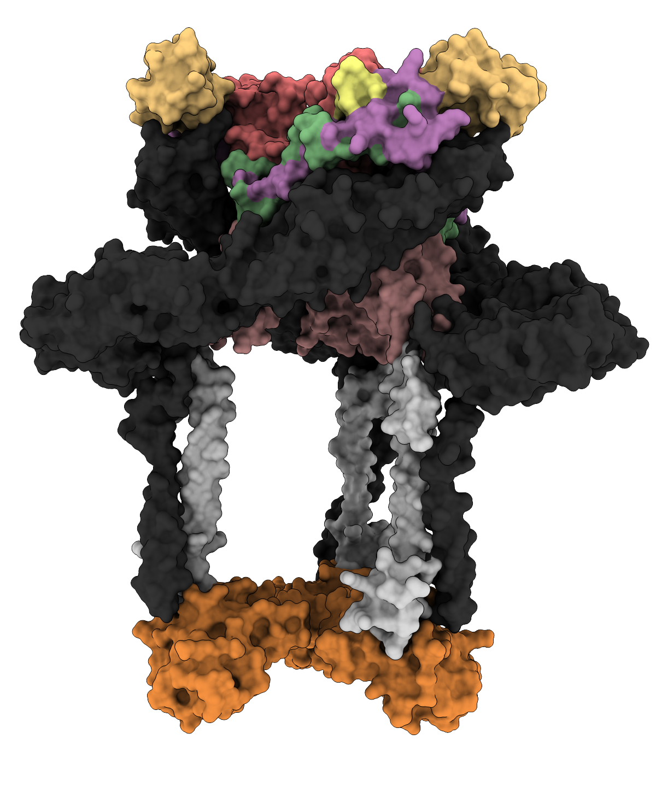

<div align = center>

# chimeraX-PDB-domains

[](LICENSE)
[](https://www.cgl.ucsf.edu/chimerax/)
[](https://www.rcsb.org/)
[](https://github.com/meganstumpf/chimeraX-PDB-domains/commits)

</div>

---

ChimeraX command scripts for visualizing protein domain organization on PDB structures, with consistent coloring schemes, publication-ready rendering settings, and automated image export.

Currently focused on alphavirus (CHIKV) structural proteins, with scripts for full-virion, trimer, and isolated ectodomain PDB entries.

<div align = center>

{width=300}

</div>

---

## Requirements

- [UCSF ChimeraX](https://www.cgl.ucsf.edu/chimerax/) (v1.11)
- Internet access to fetch structures from RCSB PDB (or local copies of `.mmcif` / `.cxs` files)

---

## Install

There is no installation required, please just clone the repository:
```
git clone https://github.com/meganstumpf/chimeraX-PDB-domains.git
```

---

## Repository structure

```
chimeraX-PDB-domains/
├── scripts/                          # ChimeraX command (.cxc) scripts
│   ├── _view_domain_labeling_3j2w.cxc
│   ├── _view_domain_labeling_3n42.cxc
│   └── _view_6nk7_virion.cxc
├── helpers/                          # Reusable Python helpers
│   ├── export_views.py               # Dump named camera views to views/<basename>_views.cxc
│   └── load_views.py                 # Load named views back from views/<basename>_views.cxc
├── views/                            # Portable camera-view definitions (tracked)
├── cache/                            # PDB .cif files pre-fetched by run_scripts.sh (gitignored)
├── sessions/                         # Saved ChimeraX sessions (.cxs), gitignored due to size
├── images/
│   ├── domains/                      # Domain-labeled structure renders
│   ├── virions/                      # Whole-virion / assembly renders
│   └── keys/                         # Color-key legend panels (one per script)
├── movies/                           # Optional rotation movies (gitignored)
├── assets/                           # Repository assets (e.g., example images)
├── run_scripts.sh                    # Batch runner — fetches PDBs and executes scripts headlessly
└── README.md
```

### PDB file caching

The scripts open structures from a repo-local `cache/` directory rather than relying on ChimeraX's default fetch location (e.g., `~/Downloads/ChimeraX/PDB/`).

`run_scripts.sh` scans every `scripts/*.cxc` for `open ../cache/<name>.cif` references and downloads any missing files from RCSB before running ChimeraX. Filenames follow RCSB conventions:

- `<pdbid>.cif` — asymmetric unit (e.g. `3j2w.cif`)
- `<pdbid>-assembly<N>.cif` — biological assembly N (e.g. `6nk7-assembly1.cif`)

If you add a new script, just reference the appropriate filename and the runner will fetch it. To force a re-download, delete the file from `cache/`.

> **Note:** `.cxs` session files are large binary files and are not tracked in git. Scripts will regenerate them on first run.

---

## Domain color scheme

A consistent color palette is used across all scripts to represent alphavirus E2 structural domains and viral proteins:

| Region | Color | Hex |
|---|---|---|
| N-terminal linker | Yellow | `#ffff7f` |
| A domain | Red | `#ff7f7f` |
| Arch 1 | Green | `#7fbe7f` |
| B domain | Orange | `#ffd17f` |
| Arch 2 | Purple | `#bf7fbe` |
| C domain | Rose | `#d19493` |
| E2 glycoprotein | Light gray | `#d3d3d3` |
| E1 glycoprotein | Dark gray | `#333333` |
| E3 glycoprotein | Blue | `#7f7fff` |
| Capsid protein | Orange | `#ee8d3e` |

---

## Scripts

### `_view_domain_labeling_3j2w.cxc` — CHIKV trimer E2 domain labeling

**PDB:** [3J2W](https://www.rcsb.org/structure/3J2W) — Chikungunya virus cryo-EM structure (trimer)

**What it does:**

- Fetches 3J2W from RCSB in mmCIF format
- Colors E1 chains (`/a–h`) dark gray, Capsid chains (`/i–l`) orange, and additional E2 copies (`/q–t`) light gray
- Colors E2 chains (`/m–p`) by domain using residue ranges (polyprotein-based numbering, offset by 1000 per chain):

| Residues | Domain |
|---|---|
| 501–515 | N-terminal linker |
| 516–634 | A domain |
| 635–672 | Arch 1 |
| 673–731 | B domain |
| 732–768 | Arch 2 |
| 769–842 | C domain |

**Outputs:**

- `images/domains/3j2w_trimer_top.png` — top-down view of the asymmetric-unit trimer
- `images/domains/3j2w_trimer_side.png` — side view of the asymmetric-unit trimer
- `images/keys/3j2w_domains_key.png` — color legend panel
- `sessions/3j2w_domain_labeling.cxs` — saved ChimeraX session

---

### `_view_domain_labeling_3n42.cxc` — CHIKV E2 ectodomain + E3 domain labeling

**PDB:** [3N42](https://www.rcsb.org/structure/3N42) — Chikungunya virus E2/E3 crystal structure

**What it does:**

- Fetches 3N42 from RCSB in mmCIF format
- Colors E3 chain (`/a`) blue, E1 chain (`/f`) dark gray
- Colors E2 chain (`/b`) by domain using residue ranges:

| Residues | Domain |
|---|---|
| 1–15 | N-terminal linker |
| 16–134 | A domain |
| 135–172 | Arch 1 |
| 173–231 | B domain |
| 232–268 | Arch 2 |
| 269–342 | C domain |

- Identifies E2 residues at the E2–E3 interface using ChimeraX `interfaces select`
- Saves views with and without interface contact highlighting

**Outputs:**

- `images/domains/3n42_e2e3_front.png` — front view, full domain coloring
- `images/domains/3n42_e2e3_side.png` — side view, full domain coloring
- `images/domains/3n42_e2e3_front_E3contacts.png` — front view, E2–E3 contact residues selected
- `images/domains/3n42_e2e3_side_E3contacts.png` — side view, E2–E3 contact residues selected
- `images/keys/3n42_domains_key.png` — color legend panel
- `sessions/3n42_domain_labeling.cxs` — saved ChimeraX session

---

### `_view_6nk7_virion.cxc` — CHIKV virion with Mxra8 receptor

**PDB:** [6NK7](https://www.rcsb.org/structure/6NK7) — Chikungunya virus virion bound to Mxra8 (biological assembly)

**What it does:**

- Fetches 6NK7 biological assembly from RCSB in mmCIF format
- Colors chains by molecule description rather than chain ID (robust to assembly chain renaming):
  - E1: dark gray (`#404040`)
  - E2: light gray (`#eaeaea`)
  - E3: blue (`#7f7fff`)
  - Capsid: orange (`#ee8d3e`)
  - Mxra8: blue (`#6bb2ff`)
- Exports views with and without Mxra8, and with and without a 100 Å scale bar

**Outputs:**

- `images/virions/6nk7_virion.png` — virion alone, no scale bar
- `images/virions/6nk7_virion_scalebar.png` — virion with scale bar
- `images/virions/6nk7_virion_mxra8.png` — virion bound to Mxra8 receptor, no scale bar
- `images/virions/6nk7_virion_mxra8_scalebar.png` — virion bound to Mxra8 with scale bar
- `images/keys/6nk7_proteins_key.png` — color legend panel
- `sessions/6nk7_virion_labeling.cxs` — saved ChimeraX session

---

## Usage

### Running a script

In-script paths use `../cache/...`, `../images/...`, etc. — relative to the `scripts/` directory, because ChimeraX changes its working directory to the location of any `.cxc` file it opens. The batch runner (`run_scripts.sh`) handles this automatically.

**From the terminal — batch runner (recommended):**

The included `run_scripts.sh` runs one or more scripts through ChimeraX, pre-fetches any missing PDB files, and creates the output directories:

```bash
cd /path/to/chimeraX-PDB-domains
./run_scripts.sh                 # run all scripts in scripts/
./run_scripts.sh 3j2w 6nk7       # run only scripts whose names match these patterns
```

If `chimerax` is not on your `PATH`, point the runner at your binary:

```bash
CHIMERAX=/Applications/ChimeraX.app/Contents/MacOS/ChimeraX ./run_scripts.sh
```

> **Note on headless rendering:** the runner launches ChimeraX with `--exit` but not `--nogui` / `--offscreen`. A ChimeraX window appears briefly because the macOS app bundle does not ship with OSMesa and needs a real OpenGL context to render PNGs. The window closes on its own once the script finishes.

**From inside the ChimeraX GUI**, first set the working directory to the repo root, then open the script:

```
cd /path/to/chimeraX-PDB-domains
open scripts/_view_domain_labeling_3j2w.cxc
```

Or open via the menu (**File → Open**) after running `cd` in the ChimeraX command line.

### Reusing a saved session

Each script saves its final state to `sessions/<basename>.cxs` at the end of a run. If that file already exists, the script opens it first (then closes the models and reloads fresh from the cif) so any session-level settings — including named camera views, if you haven't exported them via the portable `views/` workflow described below — carry over.

Session files are gitignored due to size; the preferred way to share camera framing with collaborators is the **Camera views** section below.

---

## Camera views (portable, share across collaborators)

Each script references a few named camera views (e.g. `3j2w_top_down`, `3n42_E3_front`). These are normally stored inside a session file (`.cxs`), but `.cxs` is large, binary, and tied to one workstation.

To make view definitions shareable, the repo includes a small helper pair that exports/imports views as a plain `.cxc` file under `views/`:

**1. Define views interactively (one-time setup per PDB):**

Open the script in the ChimeraX GUI (so a structure is loaded). Orient the camera, then save it:

```
view name 3j2w_top_down
```

Repeat for each angle you want.

**2. Export to a portable file:**

```
runscript ../helpers/export_views.py 3j2w
```

Only views whose name starts with the supplied basename are exported, so multiple PDBs' views never collide. The result is `views/3j2w_views.cxc` — a few lines of `view matrix camera ...` / `view name ...` pairs, safe to commit to git.

**3. Reuse from any script / any machine:**

Each main script already calls:

```
runscript ../helpers/load_views.py 3j2w
```

near the top. If `views/3j2w_views.cxc` exists, the named views are loaded into the current session and subsequent `view 3j2w_top_down` commands work without needing the session file. If the file is missing, the loader logs a warning and the script falls back to ChimeraX's default camera.

This means new contributors can clone the repo, run `./run_scripts.sh`, and get reproducible camera framing — no session sharing required.

---

## Customization

### Colors
Hex colors are passed directly to `color sel <hex>`. To change a domain color, replace the hex string in the relevant `color sel` line.

### Residue ranges
Domain boundaries are defined with `select /<chain>:<start>-<end>` blocks. Adjust the residue numbers to match a different numbering scheme or update domain definitions.

### Display style
The scripts use a shared visual preset. Key settings to adjust:

| Setting | Command | Default |
|---|---|---|
| Background | `set bg <hex>` | White (`#ffffff`) |
| Lighting | `lighting soft` / `lighting full` | Soft |
| Ambient intensity | `lighting ambientIntensity <val>` | 1.3 |
| Silhouette width | `graphics silhouettes true width <val>` | 1 |
| Supersample (output quality) | `supersample <val>` in `save` | 9 |
| Output resolution | `windowsize <w> <h>` | 600×600 |

### Views
Named views (e.g. `view 3j2w_top_down`) are loaded by each script from `views/<basename>_views.cxc`. To add or change a view, follow the export/import workflow in the **Camera views** section above - that file is plain text and safe to commit.

### Color key
The `key` command generates the legend panel. Syntax:

```
key "<hex>:<label>" "<hex>:<label>" ... size <w>,<h> pos <x>,<y> fontSize <n> font "<fontname>"
```

Adjust `fontSize`, `font`, and `windowsize` before the `save` call to resize the legend.

---

## Adding a new PDB structure

1. Copy an existing script as a template:
   ```bash
   cp scripts/_view_domain_labeling_3n42.cxc scripts/_view_domain_labeling_XXXX.cxc
   ```
2. Update the PDB ID in the `open` command.
3. Replace chain identifiers and residue ranges to match the new structure.
4. Update `view` names, then define them interactively in ChimeraX and export them with `runscript ../helpers/export_views.py <basename>` — see the **Camera views** section.
5. Update `save` output paths (put per-PDB renders in the appropriate `images/` subfolder and the color key in `images/keys/`).
6. Update the `key` command to include only the relevant labels.
7. Add an entry to documentation (e.g. README) for the additional script.

---

## Citation

If you use these scripts or figures in a publication, please cite the original PDB entries/references:

- 3J2W: Sun et al. (2013) *Structural analyses at psuedo atomic resolution of Chikungunya virus and antibodies show mechanisms of neutralization.* — [RCSB 3J2W](https://www.rcsb.org/structure/3J2W)
- 3N42: Voss et al. (2010) *Glycoprotein organization of Chikungunya virus particles revealed by X-ray crystallography.* — [RCSB 3N42](https://www.rcsb.org/structure/3N42)
- 6NK7: Basore et al. (2019) *Cryo-EM Structure of Chikungunya Virus in Complex with the Mxra8 Receptor.* — [RCSB 6NK7](https://www.rcsb.org/structure/6NK7)
- UCSF ChimeraX: Meng et al. (2023) *UCSF ChimeraX: Tools for structure building and analysis.* Protein Sci. [DOI: 10.1002/pro.4792](https://doi.org/10.1002/pro.4792)
